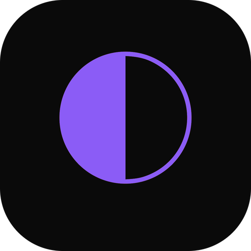

<div align="center">
  

  <h1>code-zen • 编码禅师</h1>
  
  <p>
    <strong>专注编码，禅意生活</strong>
  </p>
  <p>
    <strong>在高效编程的同时，保持身心的平衡与健康</strong>
  </p>
  
  <p>
    <a href="#特色功能"></a>
    <a href="#安装"></a>
    <a href="https://github.com/geekjourneyx"></a>
  </p>
</div>

## 🎯 项目简介

**code-zen** 是基于 [opcode](https://github.com/getAsterisk/opcode/) 二次开发的项目，**专为 [Vibe Hacks 第一届黑客松](VIBEHACKS.md) 打造**。在保留原版所有功能的基础上，重点增加了**开发者身心平衡管理功能**。

<div align="center">
  
  <br><em>编码禅师 - 专注与平静的守护者</em>
</div>

### 编码禅师的由来
> 在追求技术精进的道路上，我们常常忽视了最本质的东西——身心的平衡。**code-zen** 像一位智慧的禅师，在你专注编码时默默守护，在你需要休息时轻声提醒，让你在高效工作的同时保持内心的平静。

## 🌟 特色功能

### 💚 智能健康管理（新增）
- **智能休息提醒**：基于你的工作节奏，在最合适的时机提醒休息
- **双模式提醒**：温和模式（底部横幅）+ 积极模式（全屏提醒）
- **健康数据面板**：可视化展示你的健康习惯，包括完成率、趋势分析
- **情境感知**：自动识别专注状态，避免在编码高峰期打扰
- **夜间模式**：21点后自动停止提醒，保证睡眠质量

### 🎵 沉浸式音乐功能（新增）
- **专注音乐播放**：内置 ADHD 专注音乐，循环播放营造编码氛围
- **智能音量控制**：可调节音量，不干扰工作思路
- **自动播放设置**：启动时自动播放，无需手动操作
- **一键控制**：简单的播放/暂停控制，融入健康设置面板

### 🎯 智能时机检测（创新）
- **自然停顿识别**：在代码提交、文件保存等合适时机提醒
- **专注状态保护**：避免在你深度思考时打扰
- **个性化适配**：根据你的工作节奏调整提醒频率

### 📊 健康数据洞察
- **完成率统计**：按时完成休息任务的比例
- **趋势分析**：7天/30天健康数据可视化
- **少打扰统计**：记录因专注而延后提醒的次数
- **断点完成率**：自然停顿点的响应成功率

---

## 🚀 快速开始

### 安装步骤
1. **下载安装包**：从 [Releases](https://github.com/geekjourneyx/opcode/releases) 页面下载对应系统版本
2. **一键安装**：按照系统提示完成安装
3. **首次启动**：自动检测 Claude Code 环境

### 健康功能设置
```
设置 → 健康管理 → 个性化配置
```

- 设置提醒间隔（建议：微活动30分钟，眼保健20分钟）
- 选择提醒强度（温和/积极）
- 配置安静时段（避免休息时间）
- 启用专注音乐（内置 ADHD 音乐，可调节音量）

---

## 🏆 黑客松亮点

### 🎨 技术创新
- **Rust + React 架构**：高性能后端，流畅前端体验
- **智能算法**：基于用户行为模式的个性化提醒
- **数据可视化**：实时健康数据展示

### 💡 用户体验
- **零学习成本**：安装即用，无需复杂配置
- **无侵入设计**：温和提醒，不打扰工作流
- **个性化定制**：适应不同用户习惯

### 🏅 社会价值
- **关注程序员健康**：解决长期被忽视的职业健康问题
- **提升工作效率**：适当休息反而能提高编码效率
- **培养健康习惯**：用技术的方式帮助建立良好作息

---

## 🔧 技术架构

```
前端：React 18 + TypeScript + Tailwind CSS
后端：Rust + Tauri 2 + SQLite
通信：Tauri IPC 机制
存储：本地 SQLite 数据库
```

### 核心组件
- **HealthScheduler**：智能调度引擎
- **HealthPanel**：数据可视化面板
- **HealthNudgeBar**：温和提醒组件
- **HealthCountdown**：积极提醒模式
- **MusicManager**：沉浸式音乐管理器

---

## 👨‍💻 开发者信息

**作者**：[geekjourneyx](https://github.com/geekjourneyx)  
**博客**：[geeki.cc](https://geeki.cc)  
**X账号**：[@seekjourney](https://x.com/seekjourney)  
**相关项目**：[永恒的氛围编程艺术 | The Timeless Art of Vibe Coding](https://github.com/geekjourneyx/thewayofcode) | [网站](https://www.thewayofcode.cn)  

**项目背景**：Vibe Hacks 第一届黑客松参赛作品  
**原项目**：[opcode](https://github.com/getAsterisk/opcode/) by [Asterisk](https://asterisk.so/)  

---

## 📄 开源协议

本项目基于 AGPL-3.0 协议开源。

**重要声明**：
- 本项目是 [opcode](https://github.com/getAsterisk/opcode/) 的二次开发作品
- 保留所有原始版权声明和许可证
- 原项目版权所有：Asterisk

---

## 🤝 参与贡献

欢迎提交 Issue 和 Pull Request！

### 特别感谢
感谢原作者 Asterisk 创建的优秀项目 opcode，让我们能够在此基础上进行创新。  
感谢 Vibe Hacks 提供展示技术创意的平台。

---

<div align="center">
  <p>
    <strong>用技术守护健康，让编程更美好</strong>
  </p>
  <p>
    <a href="https://github.com/geekjourneyx/opcode">⭐ Star 支持</a>
    ·
    <a href="https://github.com/geekjourneyx/opcode/issues">🐛 提交问题</a>
  </p>
</div>

---

## 🌐 English Version

### Why Health Version?
> Programmers are the group most likely to neglect their health. We sit in front of computers for long periods, forgetting to rest, move, and protect our eyes. **opcode Health Edition** is your personal health assistant, intelligently reminding you to take breaks at the right time.

### Core Features
- **Smart Break Reminders**: Based on your work rhythm, remind you to rest at the most appropriate time
- **Dual Mode Alerts**: Gentle mode (bottom banner) + Active mode (full-screen reminder)  
- **Health Dashboard**: Visual display of your health habits, including completion rates and trend analysis
- **Context Awareness**: Automatically recognize focus state, avoid interruptions during peak coding periods
- **Night Mode**: Automatically stop reminders after 21:00 to ensure sleep quality

### Technical Innovation
- **Natural Breakpoint Detection**: AI intelligent recognition at natural pause points like code commits and file saves
- **Non-intrusive Design**: Never suddenly pop up when you're focused on coding
- **Personalized Learning**: Automatically adjust reminder frequency based on your schedule

**Made with ❤️ for Vibe Hacks First Hackathon**