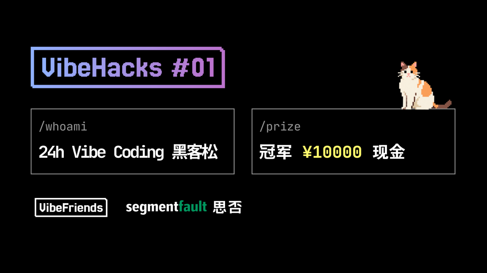
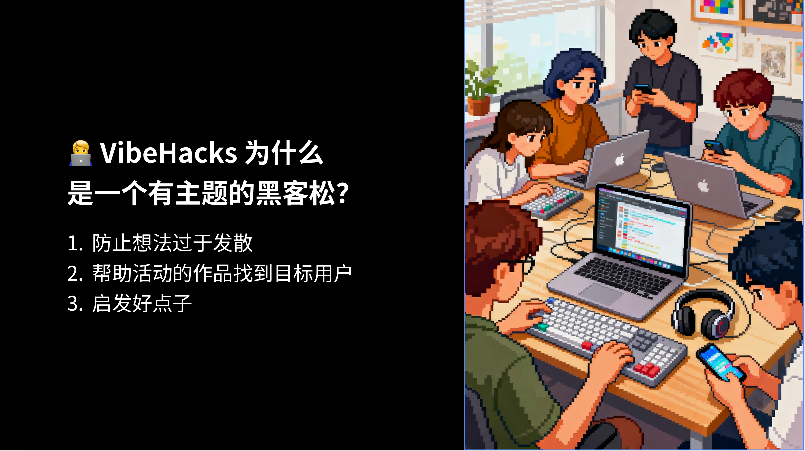
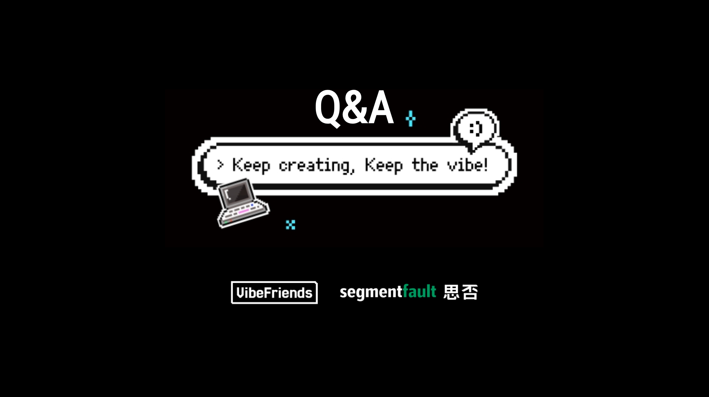
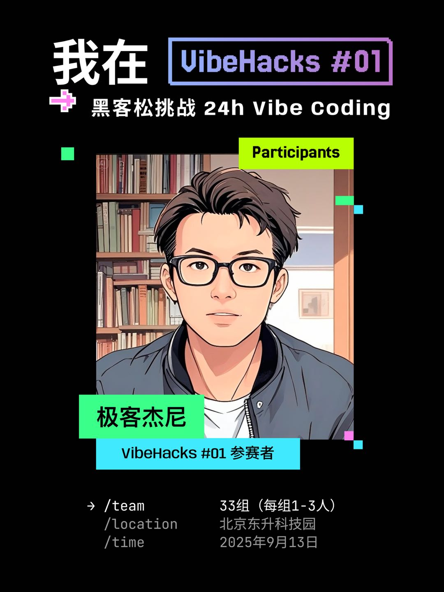
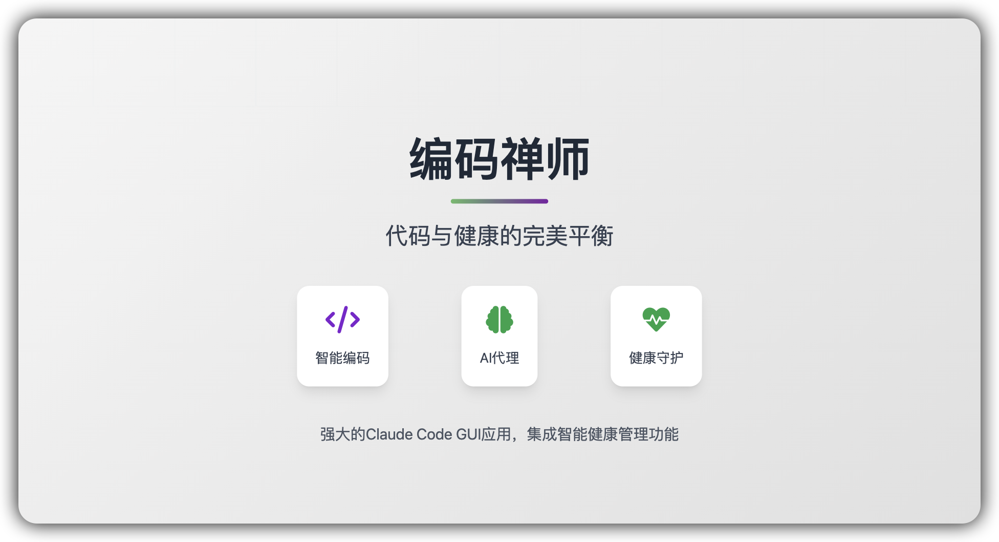
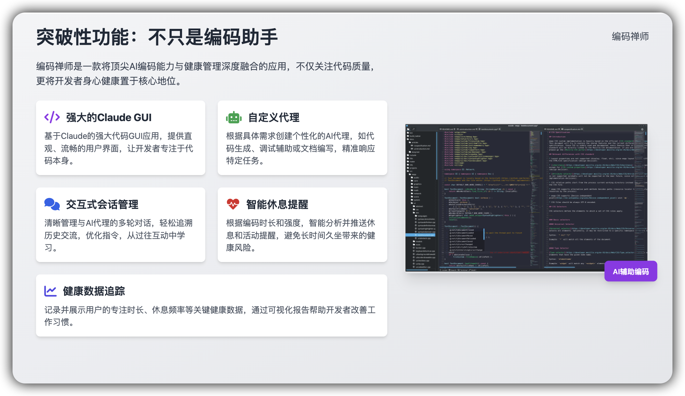
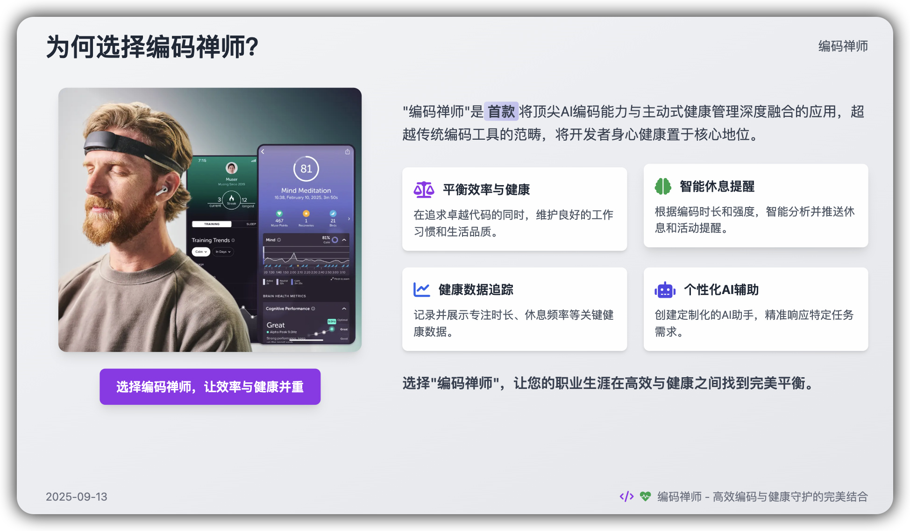

# 🧘‍♂️ code-zen • 编码禅师
## Vibe Hacks 2025 第一届黑客松参赛项目

> **队名**：东风巨浪  
> **口号**：东风巨浪，万码齐放  
> **时间**：2025年9月13日  
> **地点**：北京线下黑客松  
> **主题**：专注与平静 - 开发者身心健康管理

---

## 📸 活动剪影

<div align="center">
  <table>
    <tr>
      <td width="50%" align="center">
        
        <br><strong>Vibe Hacks 2025 活动介绍</strong>
      </td>
      <td width="50%" align="center">
        
        <br><strong>黑客松参赛者风采</strong>
      </td>
    </tr>
    <tr>
      <td width="50%" align="center">
        
        <br><strong>活动主题与宗旨</strong>
      </td>
      <td width="50%" align="center">
        
        <br><strong>活动现场QA环节</strong>
      </td>
    </tr>
  </table>
  
  <div align="center" style="margin-top: 20px;">
    
    <br><strong>东风巨浪团队参赛卡</strong>
  </div>
</div>

---

## 🎯 产品介绍

<div align="center">
  <table>
    <tr>
      <td width="33%" align="center">
        
      </td>
      <td width="33%" align="center">
        
      </td>
      <td width="33%" align="center">
        
      </td>
    </tr>
  </table>
</div>

**code-zen** 是一款专为开发者设计的身心健康管理工具，基于 opcode 二次开发，融合智能提醒、专注音乐、数据可视化等功能，让健康管理如呼吸般自然融入编码工作流。

---

## 🧘‍♂️ 项目缘起 - 专注与平衡的艺术

### 为什么选择"编码禅师"主题？

在现代编程的世界里，我们常常追求效率、功能和性能，却容易忽视一个基本事实：**只有身心平衡，才能写出真正优雅的代码**。

我们团队成员都有这样的经历：
- 💻 **专注过度**：连续编码数小时，忘记身体的基本需求
- 👁️ **用眼过度**：盯着屏幕直到眼睛干涩，才意识到该休息  
- 🌙 **作息紊乱**：为了调试bug熬夜，影响第二天状态
- 🔄 **久坐不动**：进入心流状态后，连起身活动都忘记
- 🎵 **环境干扰**：嘈杂环境影响专注，需要合适的背景音乐营造氛围

> **真正的高手，懂得在专注与放松之间找到平衡点。**

### 觉醒时刻

比赛筹备期间，一位队友因长期忽视健康而身体不适。这让我们意识到：**如果连程序员的身心健康都管理不好，又如何创造出改变世界的软件？**

于是，我们决定做一个实用而有意义的项目——**code-zen**，像一位智慧的伙伴，在你专注编码时默默守护，在你需要休息时温和提醒。

### code-zen 的朴素理念

**专注而不执迷**：全情投入编码，但不被代码束缚  
**定时而不强求**：按时提醒休息，但不强行打扰  
**数据而不沉迷**：用数据了解自己，但不被数据左右  
**循环而不僵化**：形成健康节奏，但保持灵活调整

code-zen不会强行打断你的思路，而是像一位贴心的伙伴，在你需要的时候轻声提醒：**"该活动一下了，让身心重新充满能量。"**

---

## 🔍 深度洞察

### 现有解决方案的痛点

我们调研了市面上的健康提醒软件，发现普遍存在以下问题：

<div align="center">
<table>
<thead>
  <tr>
    <th>传统方案</th>
    <th>问题分析</th>
    <th>用户痛点</th>
  </tr>
</thead>
<tbody>
  <tr>
    <td>定时提醒软件</td>
    <td>机械式固定间隔</td>
    <td>打断思路，影响效率</td>
  </tr>
  <tr>
    <td>系统自带提醒</td>
    <td>缺乏情境感知</td>
    <td>在不合适的时间弹出</td>
  </tr>
  <tr>
    <td>健身追踪器</td>
    <td>需要额外佩戴设备</td>
    <td>使用成本高，容易遗忘</td>
  </tr>
  <tr>
    <td>浏览器插件</td>
    <td>只能监控网页活动</td>
    <td>无法覆盖桌面开发环境</td>
  </tr>
</tbody>
</table>
</div>

### 平衡解决方案

**核心理念：让健康管理如呼吸般自然**

1. **智能时机把控**：不是简单定时，而是在合适的时候提醒
2. **自然融入工作**：像呼吸一样自然，在需要时出现，不需要时隐去  
3. **个性化适配**：每个开发者都有不同的习惯，算法要因人而异
4. **数据驱动改进**：用数据了解自己，让健康改善看得见摸得着

> **"好的技术，应该像空气一样，你感觉不到它的存在，但它一直在帮助你。"**

### code-zen的设计原则

**专注而不打扰**：全情投入编码，但不被强制打断  
**定时而不僵化**：按时提醒休息，但不机械执行  
**数据而不沉迷**：用数据了解自己，但不被数据绑架  
**循环而不固化**：形成健康节奏，但保持灵活调整  
**音乐而不喧宾夺主**：营造专注氛围，但不干扰思维流程

code-zen不会强行打断你的思路，而是像一位贴心的伙伴，在你需要的时候轻声提醒：**"该活动一下了，让身心重新充满能量。"** 同时用轻柔的音乐为你营造专注的编码氛围。

---

## 💡 技术方案

### 为什么选择基于opcode二次开发？

<div align="center">
  
  <br><strong>技术架构设计理念</strong>
</div>

**完美契合点：**
- 🎯 **目标用户一致**：opcode本身就是为Claude Code用户设计的
- 🔧 **技术栈匹配**：Rust+React架构，性能优异，扩展性强
- 📊 **数据基础具备**：已有项目管理和会话追踪功能
- 🎨 **UI框架完善**：shadcn/ui组件库，界面美观统一

### 技术创新

#### 1. 智能时机检测机制
```
自然停顿识别 → 专注状态保护 → 适时提醒
```

**实际检测算法**：
```typescript
// 检测代码提交、文件保存等操作时触发
const checkAtBreakpoint = async () => {
  // 读取用户偏好设置
  const prefs = await invoke('health_get_prefs');
  
  // 多重保护机制
  if (prefs.dnd) return;                    // 免打扰模式
  if (withinQuietHours(prefs)) return;      // 安静时段保护
  if (prefs.context?.breakpoints === false) return; // 断点提醒关闭
  
  // 检查是否需要提醒
  const due = await invoke('health_next_due');
  if (due.eye_ms <= 0 || due.activity_ms <= 0) {
    showGentleNudge();
  }
}
```

**自然断点算法**：
```typescript
// 在代码提交、文件保存等操作时检测
const checkAtBreakpoint = async () => {
  // 读取用户偏好设置
  const prefs = await invoke('health_get_prefs');
  
  // 多重保护机制
  if (prefs.dnd) return;                    // 免打扰模式
  if (withinQuietHours(prefs)) return;      // 安静时段
  if (isInFlowState()) return;              // 心流状态保护
  
  // 智能提醒逻辑
  const nextDue = await calculateNextReminder();
  if (nextDue.isAppropriate) {
    showGentleNudge();
  }
}
```

#### 2. 情境感知优化
- **工作强度识别**：基于代码编辑频率判断专注程度
- **作息规律学习**：记录用户的工作习惯，个性化调整
- **项目类型适配**：不同类型项目采用不同提醒策略

#### 3. 数据可视化面板
```rust
// 健康指标计算
let compliance_rate = calculate_completion_rate();  // 按时完成率
let flow_protection_count = get_avoided_reminders(); // 少打扰次数  
let breakpoint_success = get_breakpoint_completion(); // 断点完成率
```

---

## 🚀 使用指南

### 快速开始 (3步上手)

**Step 1: 下载安装**
```bash
# 从Releases页面下载对应版本
wget https://github.com/geekjourneyx/code-zen/releases/latest
```

**Step 2: 配置设置**
打开设置 → 健康管理 → 个性化配置
- 设置提醒间隔（建议：微活动30分钟，眼保健20分钟）
- 选择提醒强度（温和/积极）
- 配置安静时段（22:00-08:00）
- 启用专注音乐（内置 ADHD 音乐，可调节音量）

**Step 3: 开始使用**
正常进行编码工作，code-zen会在后台智能运行，适时提醒你休息。

### 功能详解

#### 💚 智能提醒系统
- **温和模式**：底部横幅，不打扰思路
- **积极模式**：全屏提醒，确保休息
- **一键完成**：10秒倒计时，简单操作

#### 🎵 沉浸式音乐功能（新增）
- **专注音乐播放**：内置 ADHD 专注音乐，循环播放营造编码氛围
- **智能音量控制**：可调节音量，不干扰工作思路
- **自动播放设置**：启动时自动播放，无需手动操作
- **一键控制**：简单的播放/暂停控制，融入健康设置面板

#### 📊 数据面板
- **实时统计**：今日完成次数、按时完成率
- **趋势分析**：7天/30天健康数据可视化
- **成就系统**：连续完成奖励，培养良好习惯

#### ⚙️ 个性化设置
- **工作强度调节**：根据项目复杂度调整提醒频率
- **作息规律学习**：自动适应你的工作习惯
- **项目类型识别**：不同类型项目采用不同策略

---

## 🎁 用户价值

### 对个人开发者
- **身心健康**：减少久坐危害，预防职业病，保持活力
- **效率提升**：适当休息反而能提高专注度与代码质量
- **习惯养成**：培养健康作息，实现可持续发展

### 对开发团队
- **团队健康**：统一的健康数据面板，共同关注
- **减少病假**：预防优于治疗，降低健康风险
- **提升幸福感**：关注身心健康，创造更好工作环境

### 对技术行业
- **健康意识**：推动开发者身心健康意识觉醒
- **创新方案**：用技术解决传统行业痛点，技术向善
- **社会价值**：关注人的全面发展，让技术回归人性关怀

---

## 🏆 竞争优势

### 🎯 差异化定位
| 维度 | 传统健康App | code-zen |
|-----|------------|-------------|
| **目标用户** | 普通办公人群 | 专业开发者 |
| **触发机制** | 简单定时 | 智能时机检测 |
| **打扰程度** | 强制打断 | 自然融入 |
| **数据洞察** | 基础统计 | 行为分析 |
| **技术深度** | 表层应用 | 实用算法 |

### 🚀 技术创新
1. **智能时机检测**：基于代码操作的自然停顿点识别
2. **情境感知优化**：多维度工作状态智能判断
3. **个性化适配**：基于用户行为的自适应调整
4. **数据可视化**：实用的健康数据展示与分析
5. **沉浸式音乐系统**：基于 Tauri 资源管理的本地音频播放

### 💡 创新亮点
- **零学习成本**：安装即用，无需改变现有工作习惯
- **无侵入设计**：如隐形助手，需要时出现，不需要时隐去
- **开源透明**：完全开源，数据本地存储，保护用户隐私

---

## 🔮 未来展望

### 短期规划 (1-3个月)
- [ ] **姿势检测**：集成摄像头AI姿势识别
- [ ] **语音提醒**：更自然的交互方式
- [ ] **健康报告**：生成专业的健康分析报告
- [ ] **音乐库扩展**：支持多种专注音乐类型（白噪音、自然音、Lo-Fi等）
- [ ] **智能音乐推荐**：根据编码任务类型推荐合适的背景音乐

---

## 🤝 开源贡献

我们坚信：**技术应该让人的生活更美好**

欢迎加入我们的开源社区：
- 🐛 [提交Bug反馈](https://github.com/geekjourneyx/code-zen/issues)
- 💡 [提出功能建议](https://github.com/geekjourneyx/code-zen/discussions)
- 📝 [贡献代码](https://github.com/geekjourneyx/code-zen/pulls)
- ⭐ [Star支持项目](https://github.com/geekjourneyx/code-zen)

### 特别致谢
- **原作者**：感谢Asterisk创建的优秀项目opcode
- **主办方**：感谢Vibe Hacks提供展示平台
- **团队成员**：东风巨浪战队全体成员的辛勤付出

---

## 📞 联系我们

**团队**：东风巨浪  
**队长**：[geekjourneyx](https://github.com/geekjourneyx)  
**博客**：[geeki.cc](https://geeki.cc)  
**X账号**：[@seekjourney](https://x.com/seekjourney)  
**项目地址**：[github.com/geekjourneyx/code-zen](https://github.com/geekjourneyx/code-zen)

---

<div align="center">
  <h2>🧘‍♂️ code-zen • 专注与平静的力量 🧘‍♂️</h2>
  <p><strong>专注编码，平衡生活；技术精进，身心健康</strong></p>
  <p>Vibe Hacks 2025 • 北京 • 第一届黑客松</p>
</div>